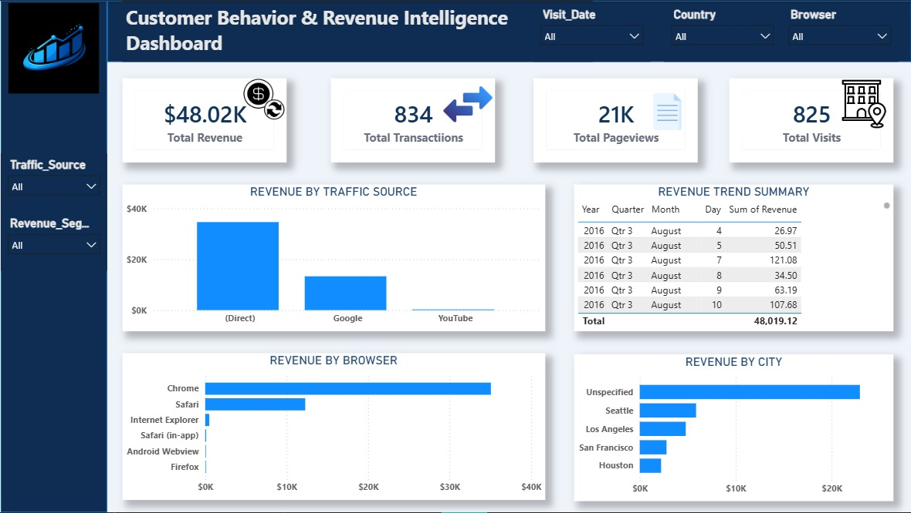
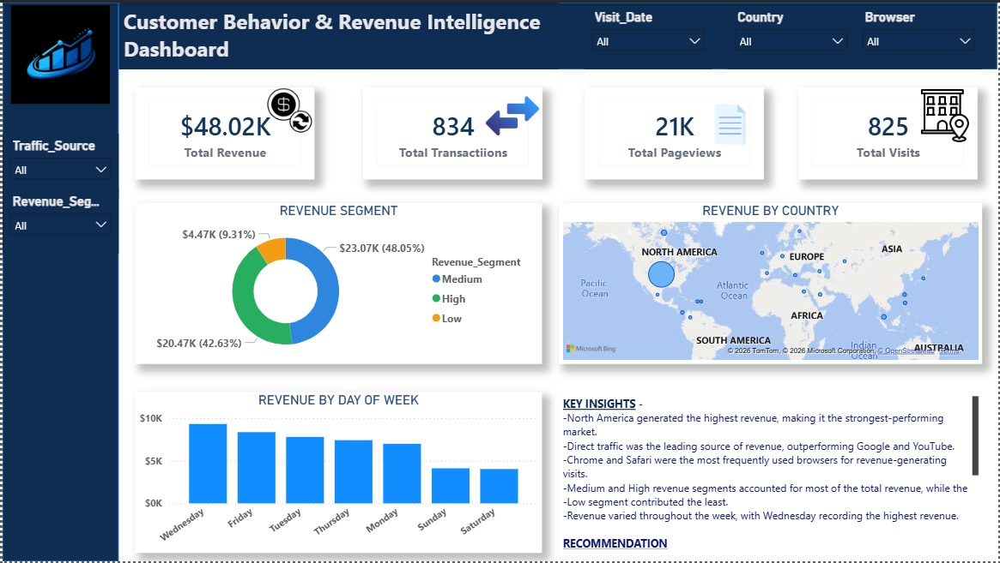

# 📊 E-Commerce Revenue & Performance Analysis

An end-to-end business analytics project analyzing customer behavior, website traffic, transaction performance, and revenue trends using **BigQuery SQL, Excel, and Power BI**.

The project demonstrates how raw website analytics data can be extracted, cleaned, analyzed, visualized, and transformed into actionable business insights.

---

## 📌 Business Scenario

A retail company wants to understand its digital performance across:

- Customer behavior
- Website traffic
- Revenue trends
- Transaction performance
- Browser usage
- Geographic performance
- Traffic source performance

The company has millions of website records stored in BigQuery and wants analysts to extract useful business data for reporting and decision-making.

---

## 🎯 Project Objectives

The objectives of this project were to:

- Extract relevant business data from multiple BigQuery tables
- Combine datasets using SQL
- Remove duplicate records
- Clean and prepare the extracted data
- Analyze revenue and customer behavior using Excel
- Build interactive Power BI dashboards
- Identify high-performing markets and traffic sources
- Generate actionable business recommendations

---

## 🛠️ Tools & Technologies

- **Google BigQuery** — Data extraction and SQL analysis
- **SQL** — Data filtering, transformation, aggregation, and preparation
- **Microsoft Excel** — Data analysis and exploration
- **Power BI** — Interactive dashboards and business intelligence
- **GitHub** — Project documentation and portfolio presentation

---

## 🗃️ Dataset

This project uses the **Google Analytics Sample Dataset** available through BigQuery.

The final dataset contains the following key fields:

| Column | Description |
|---|---|
| Visit_Id | Unique visit identifier |
| Visit_Date | Date of the website visit |
| Country | Customer country |
| Clean_City | Cleaned customer city |
| Device_Category | Device used by the customer |
| Browser | Browser used |
| Traffic_Source | Source of website traffic |
| PageViews | Number of pages viewed |
| Transactions | Number of transactions |
| Revenue | Revenue generated |
| Revenue Category | Revenue classification |
| Conversion Flag | Customer conversion status |

---

## 🔍 SQL Analysis

SQL was used to extract, combine, filter, and prepare the data for downstream analysis.

### SQL concepts applied

- `SELECT DISTINCT`
- `WHERE`
- `UNION ALL`
- `GROUP BY`
- Aggregate functions such as `SUM()`
- `CASE WHEN`
- `ORDER BY`
- `LIMIT`

The analysis combined Google Analytics session data from **2016 and 2017**.

The data was filtered based on:

- Revenue-generating sessions
- Transactions greater than zero
- Mobile users
- Selected traffic sources

Duplicate records were removed using `SELECT DISTINCT`, and the final extraction was limited to **5,000 rows**.

---

## 📈 Excel Analysis

The cleaned dataset was analyzed in Excel to identify patterns across:

- Revenue
- Transactions
- Pageviews
- Traffic sources
- Browsers
- Countries
- Cities
- Revenue categories
- Days of the week

The analysis helped identify the major revenue drivers and business trends used in the Power BI dashboard.

---

## 📊 Power BI Dashboard

The Power BI dashboard provides an interactive view of e-commerce revenue and customer performance.

### Dashboard 1 — Executive & Geographic Overview

Key metrics:

- **Total Revenue:** $48.02K
- **Total Transactions:** 834
- **Total Pageviews:** 21K
- **Total Visits:** 825

Key visualizations:

- Revenue Category
- Revenue by Country
- Revenue by Day of Week
- Geographic Revenue Distribution
- Key Business Insights
- Business Recommendations

### Dashboard 2 — Traffic & Customer Performance

Key visualizations:

- Revenue by Traffic Source
- Revenue Trend
- Revenue by Browser
- Revenue by City
- Interactive filters for date, country, browser, traffic source, and revenue category

---

## 🖼️ Dashboard Preview

### Executive & Geographic Overview



### Traffic & Customer Performance



---

## 💡 Key Insights

### 1. Strong North American Performance

North America generated the highest revenue, making it the strongest-performing market.

### 2. Direct Traffic Led Revenue Generation

Direct traffic was the leading source of revenue, outperforming Google and YouTube.

### 3. Chrome and Safari Dominated

Chrome and Safari were the most frequently used browsers among revenue-generating visits.

### 4. Medium and High Revenue Segments Dominated

Medium and High revenue segments accounted for most of the total revenue, while the Low segment contributed the least.

### 5. Wednesday Recorded the Highest Revenue

Revenue varied throughout the week, with Wednesday recording the highest revenue.

---

## 💼 Business Recommendations

Based on the analysis, the following recommendations were developed:

- Increase investment in **Direct and Google marketing channels** to maintain and grow high-performing traffic sources.
- Optimize the website experience for **Chrome and Safari** users to improve usability and conversion performance.
- Expand marketing efforts in high-performing regions, particularly the **United States**, while exploring growth opportunities in other markets.
- Launch targeted promotions during **high-performing days** to maximize revenue and customer engagement.
- Continue monitoring customer and revenue behavior through interactive dashboards to support **data-driven decision-making** and identify emerging trends.

---

## 🔄 Analytics Workflow

```text
BigQuery
   ↓
SQL Data Extraction
   ↓
Data Cleaning & Transformation
   ↓
Excel Analysis
   ↓
Power BI Dashboard
   ↓
Business Insights
   ↓
Business Recommendations
